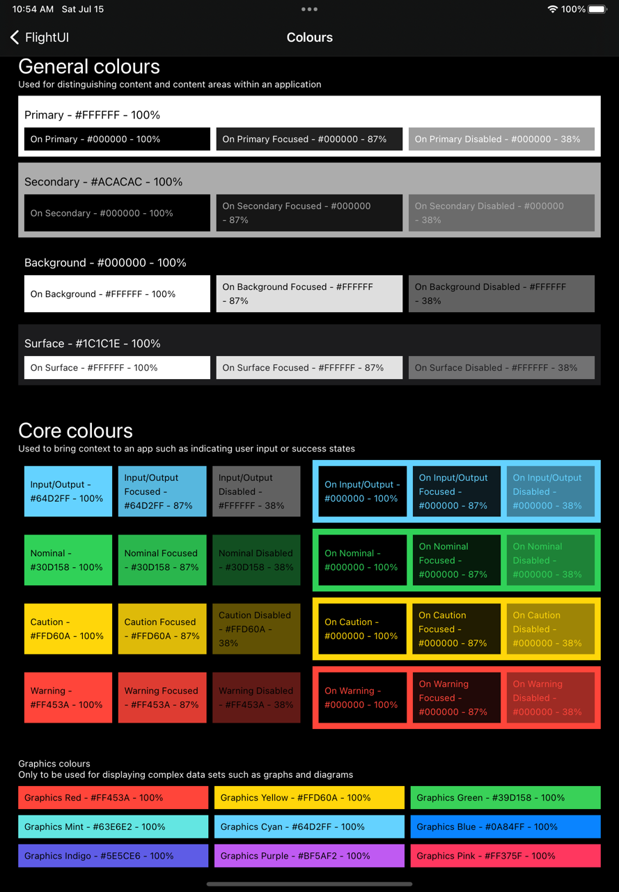
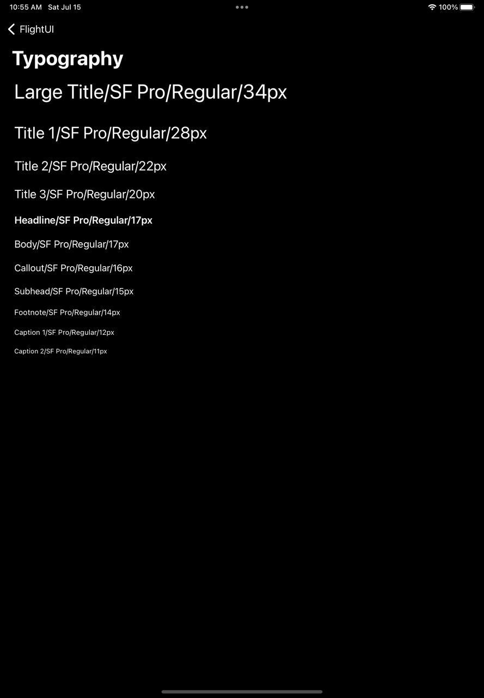
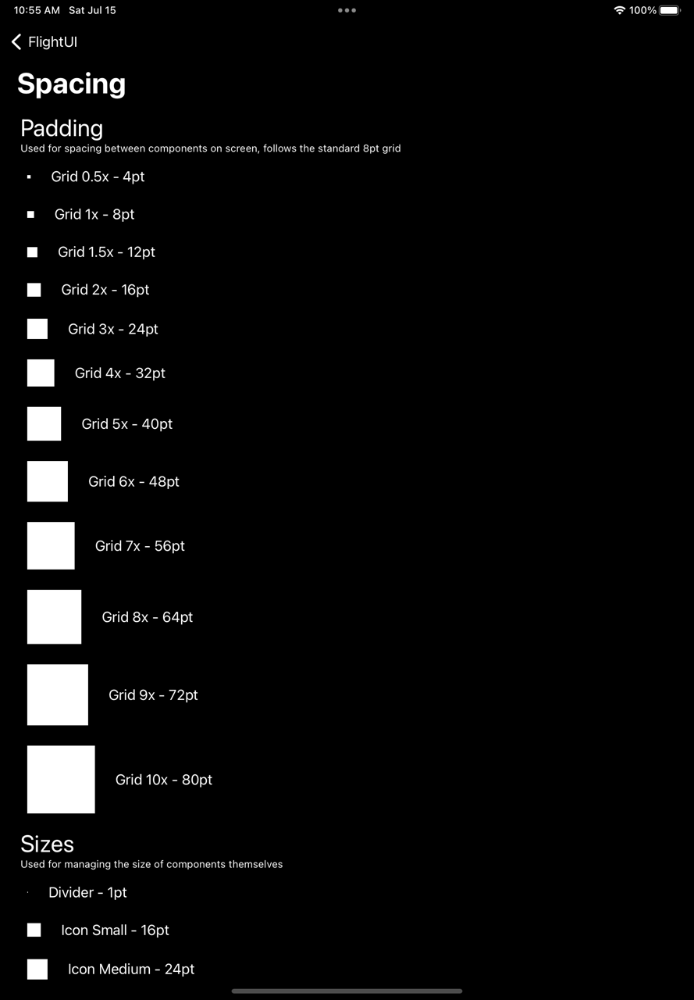
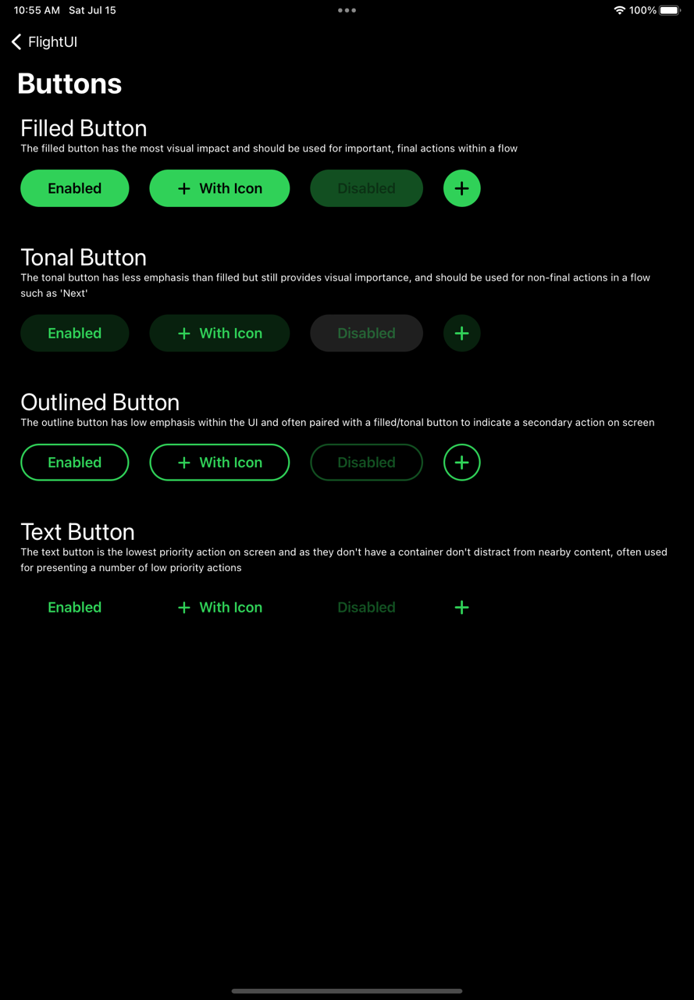

# FlightUI iOS
[](https://github.com/Royal-Air-Force/flight-ui-ios/releases)
[](https://github.com/Royal-Air-Force/flight-ui-ios/actions/workflows/on-git-tag.yml)
[](https://developer.apple.com/swift/)
[](https://github.com/realm/SwiftLint)

## 👋 Introduction
FlightUI for iOS is a [Swift Package](https://developer.apple.com/documentation/xcode/swift-packages) that enables apps used by aircrew in-flight to be developed more quickly using an approved, reusable, and well-tested set of UI components that support situational accessibility needs.

It is derived from the Society of Flight Test Engineers: Guidelines for Displays [standard](https://society-of-flight-test-engineers.github.io/handbook-2013/real-time-data-display-guidelines.html) and has been approved by the UK Air and Space Warfare Center for use across multiple mobile projects used In-Flight.

⚠️ FlightUI is currently in beta, there may be significant changes or breaking issues and full approval for all components has not been given. Please keep that in mind when using this project.

## 🤔 Raising an issue or suggestion
This project uses GitHub Issues in order to manage upcoming changes, bugs, and issues. Please bear in mind if you are raising an issue, to abide by the code of conduct in our [CONTRIBUTING](contributing.md) guidelines and to provide any steps to reproduce, screenshots, or other assets that may help us understand and resolve the issue.

If you are raising a new feature or pull request, please bear in mind that there is a desire to keep this project fairly streamlined and maintainable, not all requests will be accepted as some functionality may be intentionaly left to the implementing application. That being said, if your request is too niche for a change or pull request, you are welcome to fork the project to achieve your own goals.

## 📚 Using the Library
### Adding the Package Dependency
- Open your project in Xcode
- Go to 'File' → 'Add Packages...' or select your project in the Editor, go to Package Dependencies, and press the '+'
- Enter the Package URL, which is the GitHub repository URL for this project, https://github.com/Royal-Air-Force/flight-ui-ios
- Select the package
- Select a Dependency Rule, we recommend setting this to 'Up to Next Major Version'
- Click 'Add Package'
- Under 'Add to Target', select your main project target

### Adding the Package Dependency to Multiple Targets
- Select the additional target to add the library to in the Project Editor
- Go to the 'General' tab
- Scroll to 'Frameworks, Libraries, and Embedded Content'
- Click the '+' button and select the FlightUI package from the list
- Click 'Add'

### Providing the Theme as an Environment Object
Our recommended approach to utilising FlightUI is to provide the `ThemeManager` and `Theme` object as an Environment variable. This can be achieved by the following steps;

1. Create the `ThemeManager` instance as a State Object within your App Struct. You can provide a customised `Theme` object to the theme manager within it's constructor.
```
@main
struct MyApp: App {
    @StateObject var themeManager = ThemeManager()
}
```
2. Provide the `themeManager` and `themeManager.current` as environment objects to your navigation stack, and set the colour scheme environment to match.
```
var body: some Scene {
    WindowGroup {
        NavigationStack {
            ...
        }
        .environmentObject(themeManager)
        .environmentObject(themeManager.current)
        .accentColor(themeManager.current.onBackground.default)
        .environment(\.colorScheme, themeManager.current.baseScheme)
    }
}
```
3. When you need to access elements of FlightUI, ensure it is passed through as an environment object and then access it directly inside your View struct
```
struct MyView: View {
    @EnvironmentObject var theme: Theme

    var body: some View {
        VStack {
            ...
        }
        .background(theme.color.surface)
        .padding(.all, theme.padding.grid4x)
    }
}
```
4. If you want to change the theme, for example between light and dark, then access your Theme Manager object as an environment object and update the `current` variable
```
struct ThemeToggleButton: View {
    @EnvironmentObject var themeManager: ThemeManager
    @EnvironmentObject var theme: Theme

    var body: some View {
        Button("Light Theme", action: { themeManager.current = .light })
            .buttonStyle(theme.button.filled)
            .padding(.all, theme.padding.grid2x)
    }
}
```

## 🧩 Components and Assets
This library currently provides;
- Colours
- Typography
- Paddings, Spacing, and Radius
- Buttons
- Input Fields
- Expanding Panel

The intention is for this list of components and assets to grow over time, but these are the core elements of all our current applications.

For example usage, check out the Kitchen Sink Sample application included in this codebase.

## 🎨 Customisation
Although by default FlightUI provides a set of approved components, there may be times where you feel the need to modify certain aspects or elements of the library in order to consistently achieve a desired look within your app.

In order to do this, it is possible to create your own instance of the `Theme` object, and override only the values you wish to change while keeping the defaults the same. You can then provide your customised instance of the `Theme` object to the `ThemeManager`.

The `Theme` object takes in objects either for base level styling or components, such as `ThemeColors` for all the colour information, and `ThemeButtons` for all the button component styling. Changing the background colour of your application to yellow if you were so inclined can be as simple as;

```
@main
struct MyApp: App {
    @StateObject var themeManager = ThemeManager(current: Theme(
        color: ThemeColors(background: .yellow)
    ))
}
```

Where possible, existing SwiftUI structs and protocols have been used, making overriding consistent with implementing a theme from scratch yourself. For example, if you wished to change the `filled` button style, for example modifying the font or the colour, you can create your own implementation of the `ButtonStyle` protocol and provide this as part of your theme;
```
struct MyCustomButtonStyle: ButtonStyle {
    func makeBody(configuration: Configuration) -> some View {
        configuration.label
            .font(.largeTitle)
            .background(.blue)
    }
}

@main
struct MyApp: App {
    @StateObject var themeManager = ThemeManager(current: Theme(
        button: ThemeButtons(filled: MyCustomButtonStyle())
    ))
}
```

## 🚰 Kitchen Sink
The Sample application, included within this repository provides a demonstration of how to use and implement FlightUI in your own application. It does this by providing a runnable iOS application that provides a screen for each style or component available within the library including; colours, typography, spacing, and buttons.

This kitchen sink not only provides you with the code in order to use the theme components in your own app, but it also provides guidance on what should be used and when, such as informing the visual impact of each button and what they should be used for.

<p float="left">
  
   
  
  
</p>

## 🧐 Linting
This project uses [SwiftLint](https://github.com/realm/SwiftLint) in order to enforce Swift style and conventions. These are loosly based off the GitHub Swift Style guide and are well described in popular and common style guides such as Kodeco's Swift Style Guide.

SwiftLint enforces the style guide rules that are generally accepted by the Swift community and should be adhered to in this project. The pipeline will provide warnings if you introduce any Swift lint warnings into a pull request, and it may be requested that you fix these issues before your PR will be accepted.

## 🧪 Testing
We will use [ViewInspector](https://github.com/nalexn/ViewInspector) to develop UI-focused component tests. Apps assembled using FlightUI will continue to use Xcode UI tests running on a Simulator or physical device. (Apps may also have their own need to use ViewInspector but this is not required to consume FlightUI components).

## 🔢 Versioning
This project uses [SemVer](https://semver.org/) or Semantic Versioning, in order to manage version numbers. This follows the convention of the `MAJOR.MINOR.PATCH` style where;
- MAJOR version changes when there is an incompatible API change
- MINOR version changes when functionality is added in a backward compatible manner
- PATCH version changes when there are backward compatible bug fixes or improvements

## 🚀 Deployment
The release of a new version of the FlightUI library is managed through the use of Git Tags, where a new Git Tag is pushed to `main` referencing a commit up to date with that expected version. The Git Tag itself is named with the current version of the library (see Versioning above) and will then be available for updating within Xcode projects.

In addition to a tag, a 'GitHub Release' should also be made with every deployment of the library, this release should document the changes included and also provide information for any necessary migration that implementing applications may need to perform.

## ℹ️ Support
If you require support while using this library, you may either raise a new GitHub issue if the problem is with the library and requires an update, or for wider support, see the [FlightUI Slack Group](https://defencedigital.slack.com/archives/C05E88SK6TA) on the Defence Digital Service Slack.

## ⛙ Contributing
Contributions are welcome through GitHub pull requests and issues, for more info see the [CONTRIBUTING](CONTRIBUTING.md) file.

## 🪪 Licence
FlightUI is available under the MIT license. See the [LICENSE](LICENSE.md) file for more info.